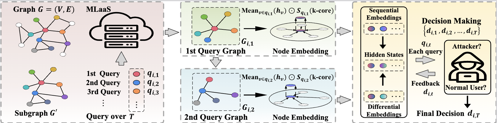

<div align="center">

<h1>[KDD 2025] ATOM: A Framework of Detecting Query-Based Model Extraction Attacks for Graph Neural Networks</h1>

  <div align="center">
  <a href="https://opensource.org/license/mit-0">
    
  </a>
  <a href="https://arxiv.org/abs/2503.16693">
    
  </a>
  <a href="https://github.com/LabRAI/ATOM">
    
  </a>
   </div>
</div>

> **ATOM: A Framework of Detecting Query-Based Model Extraction Attacks for Graph Neural Networks**    
> [Zhan Cheng¹](), [Bolin Shen²](), [Tianming Sha³](), [Yuan Gao¹](), [Shibo Li²](), [Yushun Dong²](https://yushundong.github.io/)  
> ¹ University of Wisconsin, Madison, ² Florida State University ,³ Arizona State University  

## Abstract

Graph Neural Networks (GNNs) have gained traction in Graph-based Machine Learning as a Service (GMLaaS) platforms, yet they remain vulnerable to graph-based model extraction attacks (MEAs), where adversaries reconstruct surrogate models by querying the victim model. Existing defense mechanisms, such as watermarking and fingerprinting, suffer from poor real-time performance, susceptibility to evasion, or reliance on post-attack verification, making them inadequate for handling the dynamic characteristics of graph-based MEA variants. 

To address these limitations, we propose **ATOM**, a novel real-time MEA detection framework tailored for GNNs. ATOM integrates sequential modeling and reinforcement learning to dynamically detect evolving attack patterns, while leveraging k-core embedding to capture the structural properties, enhancing detection precision. Furthermore, we provide theoretical analysis to characterize query behaviors and optimize detection strategies. 

Extensive experiments on multiple real-world datasets demonstrate that ATOM outperforms existing approaches in detection performance, maintaining stability across different time steps, thereby offering a more effective defense mechanism for GMLaaS environments.

🔗 **Source Code**: [https://github.com/LabRAI/ATOM](https://github.com/LabRAI/ATOM)

## 🖥️ Environment Setup

### 💻 **Hardware Requirements**

| Component | Specification |
|-----------|---------------|
| 🔥 **CPU** | AMD EPYC 7443 24-Core Processor |
| 🎮 **GPU** | 4x NVIDIA RTX 4090 Graphics Cards |
| 🚀 **CUDA** | Version 12.4 |

### 📦 **Software Dependencies**

All required Python packages and their versions are specified in `requirements.txt`.

```bash
# Install dependencies
pip install -r requirements.txt
```

### ⚡ **Performance Notes**
- Optimized for multi-GPU training and inference
- Supports both CPU and GPU execution modes
- Real-time processing capabilities for production deployment

## ⚙️ Configuration

### 📋 Hyperparameter Configuration

The search space for hyperparameters is located under the `./hyperparameter_config` directory:

| Model Type | Configuration File | Description |
|------------|-------------------|-------------|
| 🧠 **MLP** | `./hyperparameter_config/mlp_config.py` | Multi-Layer Perceptron baseline |
| 🔄 **RNN** | `./hyperparameter_config/rnn_config.py` | Recurrent Neural Network baseline |
| 📈 **LSTM** | `./hyperparameter_config/lstm_config.py` | Long Short-Term Memory baseline |
| 🎯 **Transformer** | `./hyperparameter_config/transformer_config.py` | Transformer-based baseline |
| 🚀 **PPO (ATOM)** | `./hyperparameter_config/ppo_config.py` | **Our proposed method** |

### 🎛️ Configuration Parameters

Each configuration file contains optimized hyperparameters for:
- Learning rates and optimization settings
- Model architecture specifications
- Training procedures and schedules
- Evaluation metrics and thresholds

## 🚀 Usage

### 📊 Dataset Testing Commands

#### 🔍 **CiteSeer Dataset**
```bash
# Baseline Methods
python hyperparameter_search.py --tp mlp --dataset CiteSeer
python hyperparameter_search.py --tp rnn --dataset CiteSeer
python hyperparameter_search.py --tp lstm --dataset CiteSeer
python hyperparameter_search.py --tp transformer --dataset CiteSeer

# ATOM (Our Method)
python hyperparameter_search.py --tp ppo --dataset CiteSeer
```

#### 📈 **Cora Dataset**
```bash
# Baseline Methods
python hyperparameter_search.py --tp mlp --dataset Cora
python hyperparameter_search.py --tp rnn --dataset Cora
python hyperparameter_search.py --tp lstm --dataset Cora
python hyperparameter_search.py --tp transformer --dataset Cora

# ATOM (Our Method)
python hyperparameter_search.py --tp ppo --dataset Cora
```

#### 📚 **PubMed Dataset**
```bash
# Baseline Methods
python hyperparameter_search.py --tp mlp --dataset PubMed
python hyperparameter_search.py --tp rnn --dataset PubMed
python hyperparameter_search.py --tp lstm --dataset PubMed
python hyperparameter_search.py --tp transformer --dataset PubMed

# ATOM (Our Method)
python hyperparameter_search.py --tp ppo --dataset PubMed
```

#### 🏛️ **Cornell Dataset**
```bash
# Baseline Methods
python hyperparameter_search.py --tp mlp --dataset Cornell
python hyperparameter_search.py --tp rnn --dataset Cornell
python hyperparameter_search.py --tp lstm --dataset Cornell
python hyperparameter_search.py --tp transformer --dataset Cornell

# ATOM (Our Method)
python hyperparameter_search.py --tp ppo --dataset Cornell
```

#### 🏫 **Wisconsin Dataset**
```bash
# Baseline Methods
python hyperparameter_search.py --tp mlp --dataset Wisconsin
python hyperparameter_search.py --tp rnn --dataset Wisconsin
python hyperparameter_search.py --tp lstm --dataset Wisconsin
python hyperparameter_search.py --tp transformer --dataset Wisconsin

# ATOM (Our Method)
python hyperparameter_search.py --tp ppo --dataset Wisconsin
```

### 📝 Command Parameters

| Parameter | Description | Options |
|-----------|-------------|---------|
| `--tp` | Model type | `mlp`, `rnn`, `lstm`, `transformer`, `ppo` |
| `--dataset` | Dataset name | `CiteSeer`, `Cora`, `PubMed`, `Cornell`, `Wisconsin` |

## Framework Architecture

### 🏗️ ATOM Framework Overview

The overall architecture of our framework is illustrated below:



### 🔧 Core Components

The **ATOM** framework consists of four main components working in synergy:

#### 1. 📊 **Query Sequence Analyzer**
- **Sequential Modeling**: Captures temporal patterns in query sequences using advanced sequence modeling techniques
- **Feature Extraction**: Extracts meaningful features from graph query patterns and structures
- **Behavioral Analysis**: Analyzes query frequency, timing, and structural characteristics

#### 2. 🎯 **k-Core Embedding Module** 
- **Structural Representation**: Leverages k-core decomposition to capture graph structural properties
- **Embedding Generation**: Generates low-dimensional embeddings that preserve crucial topological information
- **Attack Pattern Recognition**: Identifies structural anomalies indicative of extraction attempts

#### 3. 🤖 **Reinforcement Learning Agent (PPO)**
- **Dynamic Detection**: Employs Proximal Policy Optimization (PPO) for real-time attack detection
- **Adaptive Learning**: Continuously learns and adapts to evolving attack strategies
- **Policy Optimization**: Optimizes detection policies based on reward feedback mechanisms

#### 4. 🛡️ **Real-time Detection Engine**
- **Online Monitoring**: Provides continuous monitoring of incoming queries
- **Threat Assessment**: Real-time evaluation of attack probability scores
- **Alert System**: Immediate notification and response to detected threats

### ⚡ Key Advantages

- 🚀 **Real-time Performance**: Low-latency detection suitable for production environments
- 🔄 **Adaptive Learning**: Continuously evolves with new attack patterns
- 🎯 **High Precision**: Enhanced accuracy through structural and sequential analysis
- 🛡️ **Proactive Defense**: Detects attacks during execution rather than post-attack verification

## Experimental Results

### Performance Comparison

Overall performance comparison of different detection methods:


This figure demonstrates the detection performance comparison between ATOM and other baseline methods across various datasets, validating the effectiveness of our proposed approach.

### Representative Models Performance

Performance evaluation of representative models:


This shows the detection performance across different model architectures including MLP, RNN, LSTM, Transformer, and PPO (our method).

### F1 Score Analysis

#### Overall F1 Scores

F1 score comparison across different methods:


This figure quantifies the performance differences among various detection methods in terms of F1 metrics, highlighting the advantages of the ATOM approach.

#### Ablation Study Results

F1 scores from the ablation study:


The ablation experiments validate the contribution and necessity of each component within our framework.

### Detection Performance under Different Query Ratios

#### Performance with 25% Query Ratio

Detection performance with 25% query ratio:


#### Performance with 50% Query Ratio

Detection performance with 50% query ratio:


#### Performance with 75% Query Ratio

Detection performance with 75% query ratio:


These experimental results demonstrate that the ATOM framework maintains stable and excellent detection performance under different query ratios, proving the robustness of our method.

## 📋 Logs and Output

### 📁 **Directory Structure**

After running the test commands, a `Data_logs` folder will be automatically generated with the following structure:

```
📂 ./Data_logs/
├── 📄 CiteSeer_ray_tune_search_results.log
├── 📄 Cora_ray_tune_search_results.log  
├── 📄 PubMed_ray_tune_search_results.log
├── 📄 Cornell_ray_tune_search_results.log
├── 📄 Wisconsin_ray_tune_search_results.log
├── 📂 mlp/
│   └── 💾 [Model checkpoints and parameters]
├── 📂 rnn/
│   └── 💾 [Model checkpoints and parameters]
├── 📂 lstm/
│   └── 💾 [Model checkpoints and parameters]
├── 📂 transformer/
│   └── 💾 [Model checkpoints and parameters]
└── 📂 ppo/
    └── 💾 [ATOM model checkpoints and parameters]
```

### 📊 **Log Files Description**

| File Type | Content | Purpose |
|-----------|---------|---------|
| 📄 **`*.log`** | Detailed training/testing outputs | Performance monitoring and debugging |
| 💾 **Model Folders** | Trained model parameters and checkpoints | Model persistence and evaluation |

### 🔍 **Log Analysis**

- **Performance Metrics**: Each log file contains comprehensive evaluation results
- **Model Checkpoints**: Best performing model weights are automatically saved
- **Debugging Support**: Detailed logs facilitate troubleshooting and optimization
- **Reproducibility**: Saved models enable result reproduction and further analysis

### 📈 **Monitoring Training Progress**

```bash
# Real-time log monitoring
tail -f ./Data_logs/[dataset]_ray_tune_search_results.log
```

## 📄 **Citation**

```bibtex
@article{cheng2024atom,
  title={ATOM: A Framework of Detecting Query-Based Model Extraction Attacks for Graph Neural Networks},
  author={Cheng, Zhan and Shen, Bolin and Sha, Tianming and Gao, Yuan and Li, Shibo and Dong, Yushun},
  journal={arXiv preprint arXiv:2503.16693},
  year={2024},
  url={https://arxiv.org/abs/2503.16693}
}
```
